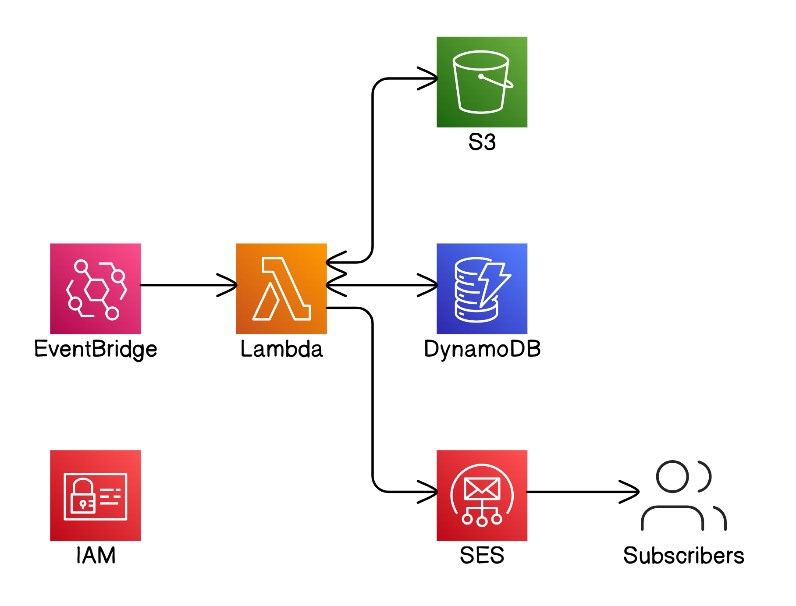

# Serverless Email Marketing App
=====================================

## Overview
This project demonstrates a serverless email marketing system using AWS services. The system consists of a DynamoDB table to store contact lists, a Lambda function to merge the email template with the contact list and send personalized emails, and an EventBridge schedule to trigger the Lambda function.

## Architecture

## AWS Services Used
1. DynamoDB Table: Stores contact lists
2. S3 Bucket: Stores email templates
3. Lambda Function: Merges email template with contact list and sends personalized emails using SES
4. EventBridge: Triggers the Lambda function on a scheduled basis
5. SES: Sends personalized emails to contacts

